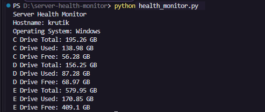
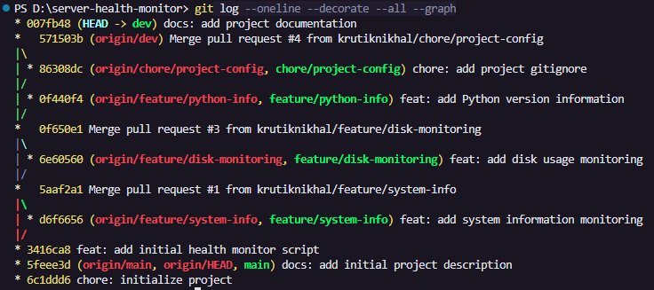
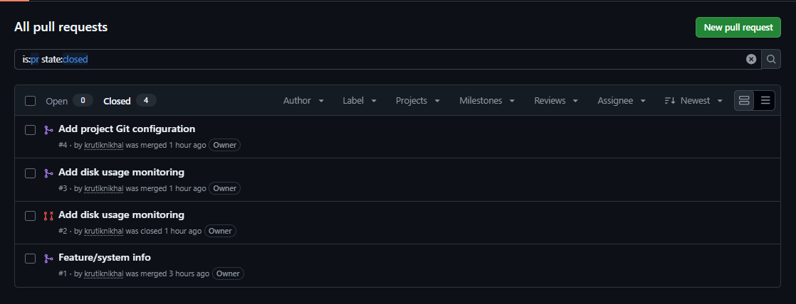
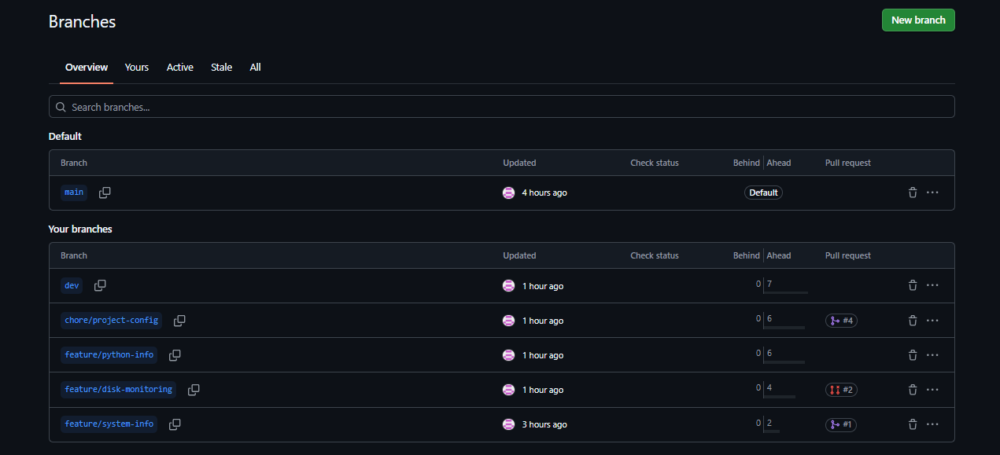

# Server Health Monitor — Git Version Control Project

A simple Python-based Server Health Monitor developed to practice and demonstrate Git and GitHub version control workflows, including branching, commits, remote repositories, pull requests, merges, `.gitignore`, and branch synchronization.

The application itself is intentionally simple so that the primary focus of the project remains on understanding and applying Git best practices.

---

## Project Overview

This project was created as part of a DevOps internship task focused on managing a project using Git and GitHub.

A lightweight Python application was developed while following a structured Git workflow. Individual changes were developed on separate branches, committed with meaningful commit messages, pushed to GitHub, reviewed through pull requests, and merged into the development branch.

The project also demonstrates that pushing a branch to GitHub does not automatically require creating a pull request or merging that branch.

---

## Objective

The main objectives of this project are to:

- Understand Git repository initialization and version control.
- Work with `main`, `dev`, `feature/*`, and maintenance branches.
- Create meaningful and structured commits.
- Push local branches to a GitHub remote repository.
- Use pull requests to review and merge changes.
- Understand local branches and remote-tracking branches.
- Practice `git fetch` and `git pull`.
- Use `.gitignore` to exclude unnecessary files.
- Document the Git workflow using Markdown.
- Use Git tags to identify a stable project version.

---

## Tools & Technologies

| Tool / Technology | Purpose |
|---|---|
| Git | Version control and branch management |
| GitHub | Remote repository and pull request workflow |
| Python | Simple application used for practicing the Git workflow |
| VS Code | Source code and documentation editing |
| PowerShell | Running Python and Git commands |

---

## Application Features

The current integrated version of the Server Health Monitor displays:

- System hostname
- Operating system
- Disk usage information
- Total disk space
- Used disk space
- Free disk space
- Disk information for C:, D:, and E: drives

Disk values are converted from bytes into GB for easier readability.

The application uses Python standard-library modules:

```python
platform
shutil
```

No external Python packages are required for the integrated application.

---

## Project Structure

```text
server-health-monitor/
│
├── health_monitor.py
├── .gitignore
├── README.md
│
├── docs/
│   ├── git-workflow.md
│   └── git-commands.md
│
└── screenshots/
```

### File Description

| File / Directory | Description |
|---|---|
| `health_monitor.py` | Python Server Health Monitor application |
| `.gitignore` | Prevents unnecessary local and generated files from being tracked |
| `README.md` | Main project documentation |
| `docs/git-workflow.md` | Detailed documentation of the Git workflow followed |
| `docs/git-commands.md` | Git commands used during the project with explanations |
| `screenshots/` | Evidence of the Git/GitHub workflow and application execution |

---

## Git Branching Strategy

The project follows a development-based branching workflow.

```text
main
 │
 └── dev
      │
      ├── feature/system-info
      │
      ├── feature/disk-monitoring
      │
      ├── feature/python-info
      │
      └── chore/project-config
```

### `main`

Represents the stable version of the project.

Development changes are not made directly on `main`. Completed work is integrated through the development workflow before being promoted to `main`.

### `dev`

Acts as the primary development and integration branch.

Completed features and project configuration changes are merged into `dev` before the final stable version is promoted to `main`.

### `feature/system-info`

Created from `dev` to implement:

- Hostname detection
- Operating system detection

The branch was pushed to GitHub and merged into `dev` through a pull request.

### `feature/disk-monitoring`

Created from `dev` to implement:

- Total disk space
- Used disk space
- Free disk space
- Monitoring of C:, D:, and E: drives

The feature was tested locally, committed, pushed to GitHub, reviewed through a pull request, and merged into `dev`.

### `feature/python-info`

Created from `dev` to add Python interpreter version information.

This branch was committed and pushed to GitHub but intentionally left without a pull request or merge.

This demonstrates an important Git concept:

```text
Push ≠ Pull Request ≠ Merge
```

A branch can exist locally and remotely without being integrated into another branch.

### `chore/project-config`

Created from `dev` for repository configuration.

This branch introduced the `.gitignore` file and was merged into `dev` through a pull request.

---

## Git Workflow

The primary feature development workflow used in this project is:

```text
dev
 │
 └── feature branch
        │
        ├── Make changes
        │
        ├── Test changes
        │
        ├── git status
        │
        ├── git diff
        │
        ├── git add
        │
        ├── git diff --staged
        │
        ├── git commit
        │
        └── git push
                │
                ▼
          GitHub Pull Request
                │
                ▼
              Review
                │
                ▼
               dev
```

This workflow keeps individual changes isolated until they are ready to be reviewed and integrated.

For more details, see:

```text
docs/git-workflow.md
```

---

## Pull Request Workflow

Pull requests were used to integrate completed work into the `dev` branch.

The following feature/configuration branches were integrated using pull requests:

```text
feature/system-info      → dev
feature/disk-monitoring  → dev
chore/project-config     → dev
```

Before merging a pull request, the base and compare branches were verified.

For example:

```text
base: dev  ←  compare: feature/disk-monitoring
```

This ensured that the feature changes were proposed for the correct destination branch.

The `feature/python-info` branch was intentionally not merged, demonstrating that creating and pushing a branch does not require a pull request.

---

## Local and Remote Branch Synchronization

One of the important concepts demonstrated in this project was the difference between local branches, remote-tracking branches, and the actual GitHub repository.

After a pull request was merged on GitHub, the local `dev` branch was not automatically updated.

The following workflow was used:

```bash
git switch dev
git fetch origin
git status
git pull
```

### `git fetch origin`

Retrieves the latest information from GitHub and updates remote-tracking references such as:

```text
origin/dev
```

It does not directly change the files in the current local branch.

### `git pull`

Updates the current local branch using changes from its configured upstream branch.

This allowed the local `dev` branch to be synchronized after pull requests were merged on GitHub.

---

## Understanding the Git Working Areas

The project also followed the standard Git change lifecycle:

```text
Working Directory
       │
       │ git add
       ▼
Staging Area
       │
       │ git commit
       ▼
Local Repository
       │
       │ git push
       ▼
Remote Repository (GitHub)
```

Before committing changes, the following workflow was commonly used:

```bash
git status
git diff
git add <file>
git diff --staged
git commit -m "message"
```

This made it possible to inspect changes before including them in a commit.

---

## Commit Strategy

Meaningful commit messages were used to describe the purpose of each change.

Examples from the project include:

```text
chore: initialize project
docs: add initial project description
feat: add initial health monitor script
feat: add system information monitoring
feat: add disk usage monitoring
feat: add Python version information
chore: add project gitignore
```

Prefixes such as `feat`, `docs`, and `chore` make the purpose of commits easier to understand from the Git history.

---

## `.gitignore`

A `.gitignore` file was added to prevent unnecessary or environment-specific files from being tracked.

```gitignore
# Python cache files
__pycache__/
*.py[cod]

# Python virtual environments
.venv/
venv/

# VS Code settings
.vscode/

# Windows system files
Thumbs.db

# Log files
*.log
```

This keeps the repository focused on source code and project documentation rather than generated or local environment files.

---

## How to Run the Application

### Prerequisites

Python must be installed and accessible from the command line.

Verify Python using:

```bash
python --version
```

### Run

Clone the repository:

```bash
git clone <repository-url>
```

Move into the project directory:

```bash
cd server-health-monitor
```

Run the health monitor:

```bash
python health_monitor.py
```

---

## Example Output

The output will be similar to:

```text
Server Health Monitor
Hostname: <computer-name>
Operating System: Windows

C Drive Total: <value> GB
C Drive Used: <value> GB
C Drive Free: <value> GB

D Drive Total: <value> GB
D Drive Used: <value> GB
D Drive Free: <value> GB

E Drive Total: <value> GB
E Drive Used: <value> GB
E Drive Free: <value> GB
```

Actual values depend on the system where the script is executed.

---

## Documentation

Additional project documentation is available under the `docs` directory.

### Git Workflow

```text
docs/git-workflow.md
```

Documents the branch strategy, feature development process, pull request workflow, and local/remote synchronization process.

### Git Commands

```text
docs/git-commands.md
```

Documents the Git commands used during the project and explains their purpose.

---

## Screenshots

The following screenshots provide evidence of the Git/GitHub workflow and application execution used throughout the project.

### Server Health Monitor Output

The application was executed locally to verify hostname, operating system, and disk usage monitoring.



---

### Git Branch and Commit History

The Git history demonstrates feature branching, merge commits, remote-tracking branches, and the intentionally unmerged `feature/python-info` branch.



---

### Pull Request History

Pull requests were used to review and integrate completed features and configuration changes into the `dev` branch.

The history also includes a pull request that was created with the wrong destination branch and closed without merging. A new pull request was then created with the correct `dev` destination.



---

### GitHub Branches

The repository contains separate development, feature, and configuration branches.

The `feature/python-info` branch was intentionally pushed to GitHub without creating a pull request or merging it, demonstrating that pushing a branch and integrating a branch are separate Git/GitHub operations.



---

## Key Git Concepts Practiced

During this project, the following concepts were practiced:

- Git repository initialization
- Working directory, staging area, and local repository
- Tracked and untracked files
- Branch creation and switching
- Feature branch isolation
- Local and remote branches
- Remote-tracking branches
- Upstream branch tracking
- Meaningful Git commits
- Reviewing changes before commits
- Pushing branches to GitHub
- Pull requests
- Merge commits
- `git fetch` vs `git pull`
- Fast-forward updates
- `.gitignore`
- Git history visualization
- Branch synchronization
- Git tags and version identification

---

## Key Learnings

This project provided practical experience with a complete Git and GitHub workflow rather than only using Git to store files.

Key learnings include:

- A Git branch is an independent pointer to a commit and allows changes to be developed in isolation.
- Switching branches changes the working directory to match the selected branch.
- `git diff` helps review unstaged changes before staging them.
- `git diff --staged` shows exactly what will be included in the next commit.
- Pushing a branch to GitHub does not automatically merge it into another branch.
- A pull request proposes that changes from one branch be integrated into another.
- The base and compare branches should always be verified before creating a pull request.
- A remote-tracking branch such as `origin/dev` represents Git's locally stored knowledge of the remote branch and may become outdated until a fetch occurs.
- `git fetch` updates remote-tracking information without directly modifying the current local branch.
- `git pull` can then synchronize the local branch with its upstream branch.
- `.gitignore` prevents unnecessary untracked files from being added to version control.
- A structured branch and pull request workflow keeps development organized and makes changes easier to review.

---

## ## Final Integration and Versioning

After the development and documentation work was completed, the `dev` branch was reviewed and merged into the stable `main` branch through a pull request.

```text
dev
 │
 │ Pull Request #5
 ▼
main
```

This final integration promoted the completed Server Health Monitor application, project configuration, documentation, and supporting evidence to the stable branch.

After the merge, the local `main` branch was synchronized with `origin/main`.

An annotated Git tag was then created to identify the first completed version of the project:

```text
v1.0.0
```

The tag points to the final `dev → main` merge commit and was pushed to GitHub, providing a permanent version reference for the completed project.

---

## Conclusion

This project demonstrates a structured Git and GitHub version-control workflow using a simple Python Server Health Monitor as the application.

The primary focus was not application complexity, but learning how changes move through a real version-control workflow—from local development and staging to commits, branches, remote repositories, pull requests, merges, and synchronization.

By separating features into branches, reviewing changes before committing, using pull requests for integration, and maintaining project documentation, the project provides practical experience with Git workflows commonly used in DevOps and software development environments.